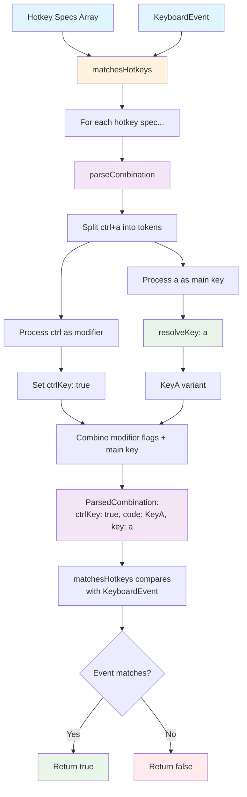

# matches-hotkeys

A clean and efficient hotkey matching library that makes keyboard shortcuts simple to work with. Built for accuracy (W3C standards), clarity (straightforward results), and developer-friendly features (aliases, cross-platform `mod` key, flexible matching rules).

This library focuses on doing one thing well: matching user-defined shortcut specifications against `KeyboardEvent` objects. It doesn't try to handle event listeners, global registries, or conflict resolution – you can combine those features yourself.

## Why choose this hotkey library?

Most lightweight hotkey helpers stick to one comparison approach (usually just `event.key` or `event.which` + modifiers) and quietly ignore ambiguous cases (numpad vs top-row digits, shifted symbols, left/right modifier keys). This library takes a different approach:

1. **Smart ambiguity handling** – When input could mean multiple things (like `"ctrl"` for left or right control), it gives you all possibilities instead of guessing.
2. **Flexible matching** – You choose how equality works through composable comparators rather than being stuck with one built-in method.
3. **Clear error handling** – Writing mistakes (duplicate modifiers, incomplete `ctrl+`) fail fast with empty results instead of unpredictable matching.
4. **Consistent data shape** – Returns a subset of `KeyboardEvent` that you can store, compare, serialize, or test easily.
5. **Cross-platform shortcuts** – Write `mod+s` once and automatically get `cmd+s` on Mac and `ctrl+s` everywhere else, without runtime platform checks.
6. **No framework lock-in** – Pure parsing functions that work with any framework or vanilla JavaScript.

## Installation

```bash
pnpm add matches-hotkeys
# or
npm install matches-hotkeys
# or
yarn add matches-hotkeys
```

Ships with ES Module, CommonJS, and IIFE builds plus TypeScript declarations.

## Architecture Overview

The library provides three core functions that work together in a layered architecture:

### Core Functions

1. **`resolveKey(token)`** - Low-level key resolution
   - Takes a single key token (like `"a"`, `"ctrl"`, `"F1"`)
   - Returns standardized key information with physical codes and key values
   - Handles aliases, ambiguity, and unknown keys

2. **`parseCombination(combination, options?)`** - Hotkey combination parsing
   - Takes a combination string/array (like `"ctrl+a"` or `["ctrl", "a"]`)
   - Processes modifiers directly, uses `resolveKey` only for the main key
   - Returns all possible variants for ambiguous inputs

3. **`matchesHotkeys(hotkeys, event, options?)`** - Event matching
   - Takes an array of hotkey specs and a `KeyboardEvent`
   - Uses `parseCombination` internally to expand each spec
   - Returns `true` if any variant matches the event

### Data Flow



### Function Relationship

Each function builds on the previous one:

- `resolveKey` handles the complexity of key identification and aliasing
- `parseCombination` orchestrates modifier logic and `resolveKey` calls
- `matchesHotkeys` uses `parseCombination` results to match real keyboard events

This layered approach means you can use any level directly:

- Use `resolveKey` for custom key processing
- Use `parseCombination` for parsing without event matching
- Use `matchesHotkeys` for complete hotkey matching functionality

---

## Basic Concepts

### Writing Combinations

Pass either a string (`"ctrl+shift+p"`) or an array (`["ctrl", "shift", "p"]`).

Simple rules (showing string form – arrays work the same way):

- Tokens split by `+` by default (configurable with `splitBy`)
- Everything except the last token must be a modifier (unless it's a single modifier like `"shift"`)
- A single modifier as the final token expands to left + right variants (e.g. `"ctrl"` becomes `ControlLeft` and `ControlRight`)
- Duplicate modifiers (`"ctrl+control+a"`) are rejected
- Incomplete input (`"ctrl+"`, `"+a"`, `"a+ctrl"`, `"a+b"`) returns empty array – treat these as authoring errors
- Unknown final tokens create a fallback object with `-1` numeric fields (never silently ignored)

### Modifiers and Physical Codes

Leading modifier segments accept logical names (`ctrl`, `meta`, `shift`, `alt`) and their common aliases (`cmd`, `command`, `win`, `option`, etc.). By default they also accept physical code names (`ControlLeft`) and code aliases (`lctrl`). You can disable this with `allowCodeAsModifier: false` to prevent implying left/right specificity that can't actually be detected in real events (since `KeyboardEvent` only exposes boolean flags).

### Ambiguity Expansion

When there's ambiguity, the parser returns multiple variants instead of guessing:

- `"ctrl"` → two results (left/right control, both with `ctrlKey: true`)
- `"shift"` → two results (left/right shift)
- `"0"` → top row `Digit0` and `Numpad0`
- `"+"` → `NumpadAdd` and shifted `Equal`

Your code typically feeds each variant into a matcher (`matchesHotkeys`) which returns on the first match.

### Result Shape

Each parsed variant is a plain object (subset of `KeyboardEvent`):

```ts
interface ParsedCombination {
  code: string; // e.g. "KeyA", "ShiftLeft" (fallback: original token)
  key: string; // logical key value (space is " ")
  keyCode: number; // legacy numeric code or -1 for unknown
  which: number; // mirrors keyCode; included for ecosystem compatibility
  metaKey: boolean;
  ctrlKey: boolean;
  shiftKey: boolean;
  altKey: boolean;
}
```

We keep both `keyCode` and `which` because some existing code still checks them. `-1` values let you detect "unknown" while keeping consistent object shape and JSON serializability.

## API Overview

| Function                                     | Purpose                                                                                 |
| -------------------------------------------- | --------------------------------------------------------------------------------------- |
| `parseCombination(combination, options?)`    | Parse user input into 0..n standardized variants                                        |
| `matchesHotkeys(hotkeys, event, options?)`   | Test if a `KeyboardEvent` matches any of the provided shortcut specs                    |
| `resolveKey(token)`                          | Low-level: resolve a single key token (used internally)                                 |
| `eq(...fields)`                              | Build a comparator that checks equality for specific fields                             |
| `and(...comparators)` / `or(...comparators)` | Combine comparators logically                                                           |
| `DEFAULT_COMPARATOR`                         | Built-in comparator: matches if (key OR code OR which OR keyCode) + identical modifiers |

Full type signatures are in the source – we avoid duplicating them here to reduce maintenance: see `src/*.ts` or generated declarations in `dist`.

## Matching Logic

`KeyboardEvent` exposes several ways to identify the "main key": `key`, `code`, `which`, `keyCode`. Browsers and keyboard layouts differ; sometimes `key` is localized while `code` is physical. The default strategy considers a hotkey a match if ANY of those identity channels align AND all four modifier booleans exactly match. This reduces false negatives when users with different layouts produce different `key` values but identical `code`.

Need stricter or looser rules? Provide a custom comparator. Example: ignore `shiftKey` when matching symbol shortcuts where the symbol itself implies shift.

```ts
import { matchesHotkeys, eq, and, or, type Comparator } from "matches-hotkeys";

// Comparator that ignores shift but still requires other modifiers and main key identity
const IGNORE_SHIFT: Comparator = or(
  and(eq("key", "altKey", "ctrlKey", "metaKey")),
  and(eq("code", "altKey", "ctrlKey", "metaKey")),
  and(eq("which", "altKey", "ctrlKey", "metaKey")),
  and(eq("keyCode", "altKey", "ctrlKey", "metaKey")),
);

document.addEventListener("keydown", (e) => {
  if (matchesHotkeys([{ combination: "a" }], e, { comparator: IGNORE_SHIFT })) {
    // Treat "a" and "Shift+a" the same
  }
});
```

## Usage Patterns

### 1. Simple Command Palette Trigger

Common UX pattern: `cmd+shift+p` (macOS) / `ctrl+shift+p` (Windows/Linux). Write once with `mod`.

```ts
import { matchesHotkeys } from "matches-hotkeys";

const OPEN_PALETTE = [{ combination: "mod+shift+p" }];

window.addEventListener("keydown", (e) => {
  if (matchesHotkeys(OPEN_PALETTE, e)) {
    e.preventDefault();
    openCommandPalette();
  }
});
```

### 2. Multiple Alternatives for Accessibility

Provide both a mnemonic and platform-conventional shortcut.

```ts
const SAVE = [
  { combination: "mod+s" }, // Standard save
  { combination: ["ctrl", "enter"] }, // Alternative for screen reader contexts
];

window.addEventListener("keydown", (e) => {
  if (matchesHotkeys(SAVE, e)) saveDocument();
});
```

### 3. Prevent Left/Right Modifier Confusion

Teams want to avoid writing `ControlLeft+S` which implies side specificity that isn't actually matched differently.

```ts
import { parseCombination } from "matches-hotkeys";

function safe(spec: string) {
  const result = parseCombination(spec, { allowCodeAsModifier: false });
  if (result.length === 0) throw new Error(`Invalid spec: ${spec}`);
  return result;
}

// safe("ControlLeft+s") → [] (invalid), forces authors to use logical modifiers
```

### 4. Storing User Custom Shortcuts

Users configure `ctrl+alt+k`. Store the canonical parsed object (or original string) for re-hydration.

```ts
import { parseCombination } from "matches-hotkeys";

function toPersisted(spec: string) {
  const variants = parseCombination(spec);
  // Keep original spec + variant list for display/matching strategies
  return { spec, variants };
}
```

### 5. Handling Ambiguous Numeric Row vs Numpad

Trigger same action for either top row or numpad digits – parser expansion makes this easy.

```ts
const DIGIT_ZERO = parseCombination("0"); // two variants
// Later: check if any variant matches event via your own comparator or matchesHotkeys wrapper
```

## Error Handling

We don't throw for authoring errors – we return empty arrays. This works well with functional composition (map/filter pipelines) and simplifies validation: `if (parsed.length === 0) showAuthoringError()`. Throwing would require try/catch at call sites and complicate bulk parsing flows.

## Configuration Options

| Option                | Default                           | Purpose                                                                             | When to Change                                                                         |
| --------------------- | --------------------------------- | ----------------------------------------------------------------------------------- | -------------------------------------------------------------------------------------- |
| `splitBy`             | `"+"`                             | Token separator in string form                                                      | When you need literal plus: set `splitBy` to something else (e.g. `"-"`)               |
| `trim`                | `true` (string) / `false` (array) | Whitespace trimming per token                                                       | Set `false` for string form if you need space key as last token without manual quoting |
| `allowCodeAsModifier` | `true`                            | Accept physical code tokens (`ShiftLeft`) / aliases (`lctrl`) in modifier positions | Set `false` to discourage misleading left/right specificity                            |

## Comparator Composition

Comparators are just `(a, b) => boolean` where `a` is parsed variant, `b` is a `KeyboardEvent`. Build them with helpers:

```ts
import { eq, and, or, DEFAULT_COMPARATOR } from "matches-hotkeys";

// EXACT: require code match + modifiers (ignores key variants)
const CODE_ONLY = and(
  eq("code"),
  eq("altKey", "ctrlKey", "metaKey", "shiftKey"),
);

// Accept either code or key path (mirrors DEFAULT_COMPARATOR minus which/keyCode legacy fields)
const HYBRID = or(
  and(eq("code"), eq("altKey", "ctrlKey", "metaKey", "shiftKey")),
  and(eq("key"), eq("altKey", "ctrlKey", "metaKey", "shiftKey")),
);
```

`DEFAULT_COMPARATOR` is defined in `src/comparators.ts` – reference there for exact logic instead of copying into docs.

## Performance Notes

- Core lookup tables (`LOWERCASE_CODE_MAP`, `CODE_ALIAS_MAP`, `MODIFIER_KEY_MAP`) are built once at module load – hot path parsing is mostly array and map operations
- Typical simple combination (`"ctrl+a"`) parses to a single object with O(number_of_tokens) steps
- Ambiguous tokens (modifiers, digits, symbols) allocate small additional arrays; caller code usually short-circuits on first match
- No DOM access besides `navigator.userAgent` for `mod` mapping (cached via direct call each parse; if you need to avoid UA sniffing you can pre-normalize `mod` yourself before calling API)

## Testing & Reliability

The repository includes comprehensive inline snapshot tests for: parsing grammar, ambiguity expansion, alias handling, option toggles, platform variance, and key resolution. See `src/parseCombination.ts` & `src/resolveKey.ts` for real output shapes (kept as inline snapshots to detect regressions when updating key data sources).

To run tests locally:

```bash
pnpm install
pnpm test
```

## FAQ

**Q: Why return `-1` instead of `undefined` for unknown numeric fields?**  
A: Preserves consistent object shape (all numeric fields present) while allowing explicit detection by checking `keyCode === -1`.

**Q: Why keep `which` when it's deprecated?**  
A: Some legacy comparison code still inspects it. Including it avoids conditional logic at call sites and simplifies comparator composition.

**Q: Can I distinguish left vs right modifiers when matching combos like `ctrl+a`?**  
A: Not at match level using standard `KeyboardEvent` booleans. You would need separate logic (e.g. listen and inspect `event.code` of the modifier itself). We intentionally avoid implying a distinction we cannot reliably check.

**Q: Does this handle sequences (e.g. `g g` like in Vim)?**  
A: No – out of scope. Layer this library inside your own state machine for sequences.

## Contributing

Contributions welcome. Please keep scope focused (parsing, resolution, comparator ergonomics). Open an issue before adding large new categories of keys or behavior that might expand maintenance surface.

## Related Reading

- W3C UI Events KeyboardEvent code values: <https://www.w3.org/TR/uievents-code/>
- W3C UI Events key values: <https://www.w3.org/TR/uievents-key/>

## License

MIT © Ze-Zheng Wu
